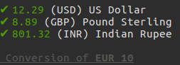

# cash

Cash is a NodeJS library that allow to convert currency.

## Features

Convert an amount of currency A into a currency B. Each currency must  be contained in the following available Currency list :

|AVAILABLE CURRENCY|
|--------------|
|  AUD | Australian Dollar |
|  RUB |  Russian Rouble |
|  EUR |  Euro             |
|  BGN |  Bulgarian Lev    |
|  BRL | Real Brazilian     |
|  CAD |  Canadian Dollar |
|  CHF |  Swiss Franc |
|  CNY |  Chinese Yuan |
|  CZK |  Czech Koruna |
|  DKK |  Danish Krone |
|  GBP |  Pound Sterling |
|  HKD |  Hong Kong Dollar |
|  HUF |  Hungarian Forint |
|  IDR |  Indonesian Rupiah |
|  HRK |  Croatian Kuna |
|  ILS |  Israeli Shekel |
|  INR |  Indian Rupee |
|  JPY |  Japanes Yen |
|  KRW |  South Korean Won |
|  MXN |  Mexican Peso |
|  MYR |  Malaysian Ringgit |
|  NOK |  Norwegian Krone |
|  PHP |  Philippine Peso |
|  PLN |  Polish Zloty |
|  RON |  Romanian New Leu |
|  SEK |  Swedish Krona |
|  SGD |  Singapore Dollar |
|  THB |  Thai Baht |
|  TRY |  Turkish Lira |
|  USD |  US Dollar |
|  ZAR |  South African Rand |
|  NZD |  New Zealand Dollar|


## Installation

- Install NodeJS
- Open a terminal (`cmd` or Powershell on Windows , Terminal on ### Linux)
- Type  `npm install` it will install all dependencies needed.
- Now you can enjoy !

## API

### Convert currency
To convert currency try :
```
node index.js <amount> <currency>```

With :
- `amount` (int) : the amount you want to convert
- `currency`(String) : currency you want to convert to

### Example

If you want to convert 10 Euros in US Dollar or Pound Sterling or Indian Rupee :
```
node index.js 10 eur usd inr ```

That will give you :

<p >
  
</p>

### Others commands

Save currencies as default currencies :

```
    node index.js --save eur pln aud       ```


Display help message :

```
    node index.js --help      ```

Display version :

```
    node index.js --version      ```
